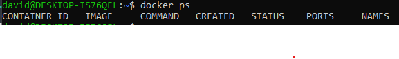
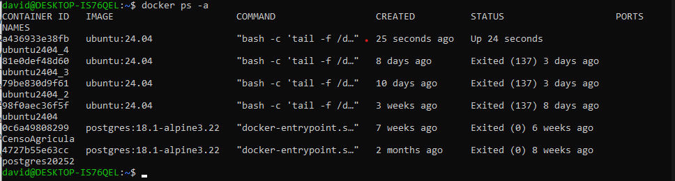
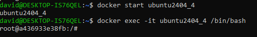

# Introdução

Esta documentação trata-se do passo a passo de como instalar e configurar o acesso remoto (**SSH**) e o firewall (**UFW**) em um sistema Linux, utilizando o **WSL**, que será exemplificado na versão **Ubuntu 24.04**.  
Recomenda-se utilizar uma máquina container do Ubuntu 24.04 (**Docker**).

## Requisitos básicos

1. Ter Docker instalado  
2. Ter WSL instalado  
3. 8 GB de RAM  

## Primeiros passos

Para iniciar, devemos abrir dois terminais via WSL como administrador: um será o nosso servidor e o outro, o nosso cliente.

### Gerando os containers com a imagem Ubuntu 24.04

Vamos utilizar os seguintes comandos:

` docker run --privileged -d --name ubuntu2404_4 ubuntu:24.04 bash -c "tail -f /dev/null"`

com isso criamos nosso container, porem não sabemos se estar ativo ou não.

Para isso, primeiro verificamos se há algum container ativo utilizando o comando:

   `docker ps`

Deve aparecer algo assim:

Isso indica que não a nenhum conteiner ativo.

Para ativar, usaremos os seguintes comandos:

`docker ps -a`

com isso lista todas os container ativos e não ativos.

Verificamos que o conteiner criado não esta iniciado.

Para iniciamos ele, usaremos os seguintes comandos:

`docker start ubuntu2404_4`

Apos a execução desse comando o conteiner esta inicializado, porem ainda não temos acesso a imagem do UBUNTU20.24.

Para acessar a maquina usaremos esse comando:

`docker exec -it ubuntu2026_4` /bin/bash

Apos a execução desse comando, você estará dentro da maquina, como nosso terminal é de adm já entramos como root, tendo acesso total a todos os comandos de super ursuario

Para a segundo container é só repetir todo o passo a passo e mudar o final no nome da maquina igual aqui.

` docker run --privileged -d --name ubuntu2404_5 ubuntu:24.04 bash -c "tail -f /dev/null"`

Com isso temos nosso ambiente pronto para começar as instalações necessarias para o *SSH* e o *UFW*, porem alem desse será necessario a instalação de mais um serviço o *SystemCtl*, para termos um maior controle.

## Instalando o SystemCtl

Para isso, usaremos o comando:

`apt update && apt install -y systemctl`
`apt install -y systemd systemd-sysv dbus dbus-user-session
`

## Instalando UFW

Apos a instalação do systemctl, vamos instalar o *UFW*.

Para isso vamos usar o comando: `apt install -y ufw` 

Em seguida vamos ativar o UFW e deixar ele como enable, usandos esses dois comandos:

`systemctl status ufw`, `systemctl start ufw` e `systemctl enable ufw` 

Com isso, vemos o estado se ta ativo, por padrão não vem, iniciamos ele e deixamos ele para subir junto com a maquina quando for inicializada

Para finalizar abriremos acesso a porta 22 usando esse comando: 

`ufw allow 22`

com isso a instalação do *UFW* esta concluida

## Instalando SSH

Nesse passo são duas instalações diferentes, um vai ser nosso cliente e outro o servidor.

### Servidor SSH

Para isso, usaremos os seguintes comandos:

`   apt update 
	 && apt install -y openssh-server 
	 && mkdir /var/run/sshd`

Vamos configurar agora nosso SSH.

Aqui vai seguintes comandos para que você tenha os primeiros contatos.

`
echo 'root:123456' | chpasswd

sed -i 's/#PermitRootLogin prohibit-password/PermitRootLogin yes/' /etc/ssh/sshd_config

sed 's@session\s*required\s*pam_loginuid.so@session optional pam_loginuid.so@g' -i /etc/pam.d/sshd
`

Apos isso, vamos fazer a mesma coisa que fizemos com o *UFW*

`systemctl status ssh.service`, `systemctl start ssh.service` e `systemctl enable ssh.service` 

com isso o servidor esta configurado

### SSH Cliente 

**OBS**: Isso fica na outra maquina

Para o cliente é ainda mais facil.

Precisa usar apenas esse comando:

`apt install openssh-client`

## Fazendo a conexão via SSH

Para isso vamos usar o seguinte comando:

nome da maquina alvo e seu IP ( hostname -i )

`root@172.17.0.2`

Apos isso vai aparecer algo para troca de chaves e você responde YES, e com isso adicona a senha para se conectar.

Terminando isso você conseguiu acessar remotamente outra maquina utilizando o SSH, e para confirmar isso, se você perceber bem, as duas maquinas estão com o mesmo IP.
